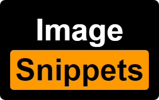
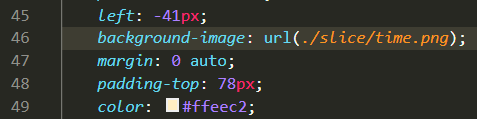
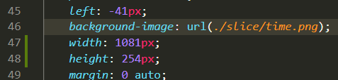

# Image Snippets

"Image Snippets" can detect your image source path at last line, auto complete some snippets such as width / height.

## Features

customize your template

> e.g. `background-size: ${width}px ${height}px;`

## Extension Settings

- `Extension.tpl`: Custom snippets template, (e.g. `width: ${width}px;`)

  > some **Available Variables** below to inject into template

  | variable | description           |
  | -------- | --------------------- |
  | width    | image original width  |
  | height   | image original height |

## TODO

- [x] Support `alias` detected in `tsconfig.json` or `jsconfig.json`
- [x] Support http(s) url detect
- [ ] Support Array for `Extention.tpl`, set multi spinnets avaliable!
- [ ] Get more variables about image information injects to template if need
